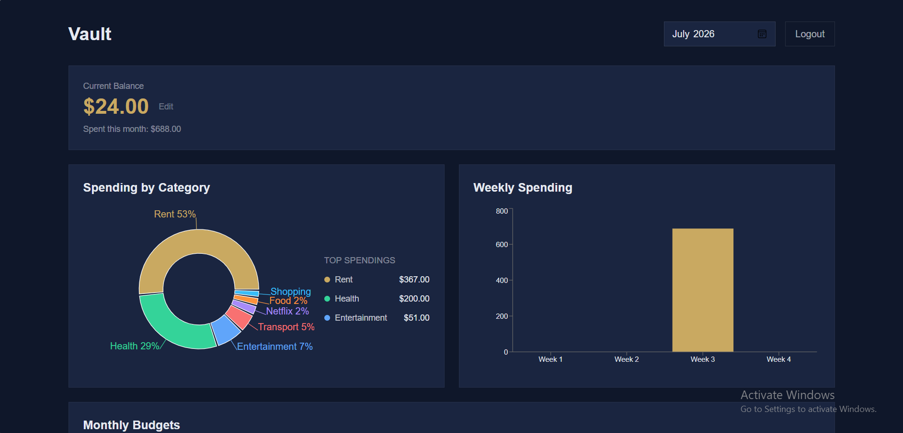
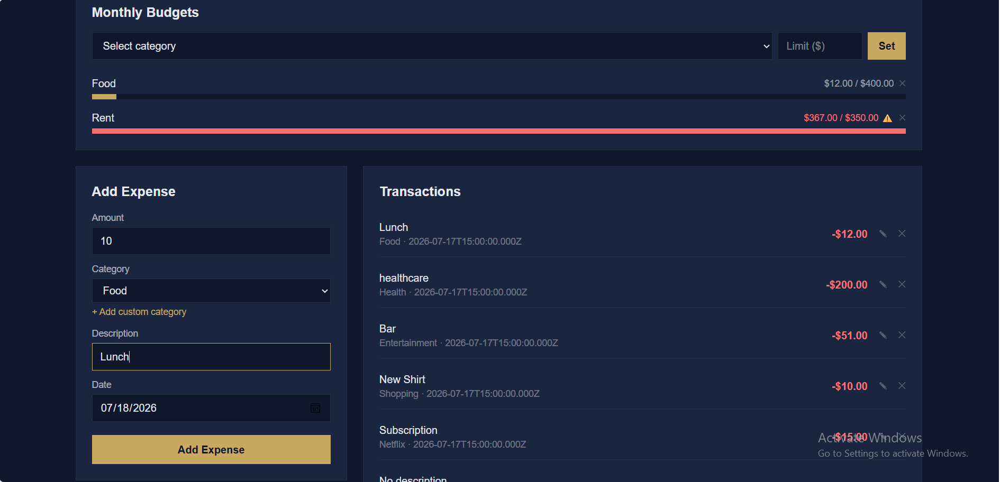
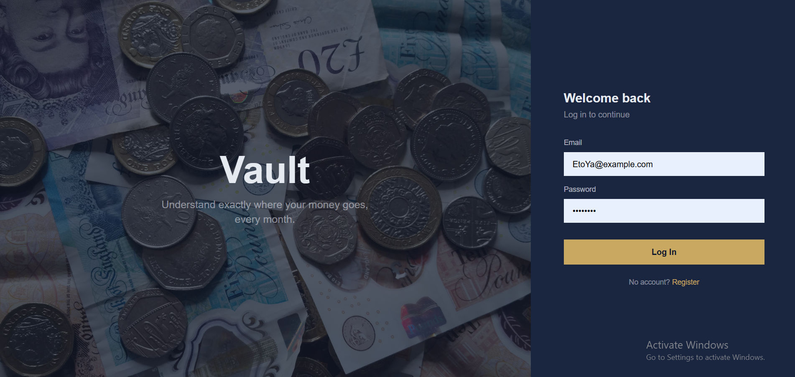

# Vault

A full-stack personal finance tracker — log expenses, set category budgets, and see exactly where your money goes with interactive charts.
Built as a portfolio project to demonstrate full-stack fundamentals beyond basic CRUD: relational data modeling, derived financial calculations, budget tracking, and flexible date-range reporting.

## Screenshots

### Dashboard



### Login



### Register



## Features

- **Auth** — Register/login with hashed passwords (bcrypt) and JWT-based sessions
- **Expense tracking** — Log transactions with amount, category, description, and date (including backdating past expenses)
- **Editable balance** — Correct your current balance at any time; the app back-calculates the underlying baseline so the math stays consistent
- **Custom categories** — Comes with 8 default categories, with the ability to add your own
- **Category budgets** — Set a monthly spending limit per category, with a visual progress bar and overspend warning
- **Date range filtering** — View spending for Today, This Week, This Month, This Year, or a custom range
- **Spending by category** — Pie chart + ranked list showing exactly what % of spending went where
- **Spending over time** — Bar chart that adapts its grouping (daily/weekly/monthly) based on the selected date range
- **Full transaction management** — Add, edit, and delete any transaction

---

## Tech Stack

**Frontend**

- React (Vite)
- React Router
- Tailwind CSS
- Recharts

**Backend**

- Node.js + Express
- PostgreSQL (hosted on Neon)
- JWT for authentication
- bcrypt for password hashing

---

## Database Schema

```
users
  id, email, password_hash, starting_balance, created_at

categories
  id, user_id (nullable FK → users), name, is_default

transactions
  id, user_id (FK), category_id (FK), amount, description, date, created_at

budgets
  id, user_id (FK), category_id (FK), monthly_limit
  UNIQUE(user_id, category_id)
```

**Notable design decisions:**

- `amount` and `monthly_limit` use `NUMERIC(12, 2)`, not `FLOAT` — money should never use floating-point types, since they might lead to rounding errors.
- `categories.user_id` is nullable: default categories have `user_id = NULL` (visible to everyone), while custom categories are scoped to the user who created them. Queries just do `WHERE user_id IS NULL OR user_id = <current user>`.
- Deleting a category sets `transactions.category_id` to `NULL` instead of deleting the transaction (`ON DELETE SET NULL`) — financial history shouldn't disappear just because a category was removed.
- Current balance is **derived**, not stored directly: `currentBalance = starting_balance - SUM(all transactions)`. Editing the displayed balance actually recalculates `starting_balance` under the hood so the math stays consistent going forward.

---

## API Endpoints

| Method | Endpoint                              | Description                       | Auth required |
| ------ | ------------------------------------- | --------------------------------- | ------------- |
| POST   | `/api/auth/register`                  | Create a new user                 | No            |
| POST   | `/api/auth/login`                     | Log in, returns a JWT             | No            |
| PUT    | `/api/auth/balance`                   | Update current balance            | Yes           |
| GET    | `/api/categories`                     | List default + custom categories  | Yes           |
| POST   | `/api/categories`                     | Create a custom category          | Yes           |
| GET    | `/api/transactions?from=&to=`         | List transactions in a date range | Yes           |
| POST   | `/api/transactions`                   | Create a transaction              | Yes           |
| PUT    | `/api/transactions/:id`               | Edit a transaction                | Yes           |
| DELETE | `/api/transactions/:id`               | Delete a transaction              | Yes           |
| GET    | `/api/transactions/summary?from=&to=` | Category breakdown + balance      | Yes           |
| GET    | `/api/budgets?from=&to=`              | List budgets with actual spending | Yes           |
| PUT    | `/api/budgets`                        | Set/update a category budget      | Yes           |
| DELETE | `/api/budgets/:id`                    | Delete a budget                   | Yes           |

Protected routes expect an `Authorization: Bearer <token>` header.

---

## Running Locally

### Prerequisites

- Node.js installed
- A PostgreSQL database (e.g. a free [Neon](https://neon.tech) instance)

### 1. Clone the repo

```bash
git clone <your-repo-url>
cd finance-tracker
```

### 2. Backend setup

```bash
cd backend
npm install
```

Create a `.env` file in `backend/` (see `.env.example`):

```
DATABASE_URL=your_postgres_connection_string
JWT_SECRET=your_random_secret_string
PORT=5001
```

Create the tables (run in your Postgres SQL editor):

```sql
CREATE TABLE users (
  id SERIAL PRIMARY KEY,
  email TEXT UNIQUE NOT NULL,
  password_hash TEXT NOT NULL,
  starting_balance NUMERIC(12, 2) DEFAULT 0,
  created_at TIMESTAMP DEFAULT NOW()
);

CREATE TABLE categories (
  id SERIAL PRIMARY KEY,
  user_id INTEGER REFERENCES users(id) ON DELETE CASCADE,
  name TEXT NOT NULL,
  is_default BOOLEAN DEFAULT FALSE
);

CREATE TABLE transactions (
  id SERIAL PRIMARY KEY,
  user_id INTEGER REFERENCES users(id) ON DELETE CASCADE,
  category_id INTEGER REFERENCES categories(id) ON DELETE SET NULL,
  amount NUMERIC(12, 2) NOT NULL,
  description TEXT,
  date DATE NOT NULL,
  created_at TIMESTAMP DEFAULT NOW()
);

CREATE TABLE budgets (
  id SERIAL PRIMARY KEY,
  user_id INTEGER REFERENCES users(id) ON DELETE CASCADE,
  category_id INTEGER REFERENCES categories(id) ON DELETE CASCADE,
  monthly_limit NUMERIC(12, 2) NOT NULL,
  UNIQUE(user_id, category_id)
);

INSERT INTO categories (user_id, name, is_default) VALUES
  (NULL, 'Food', TRUE),
  (NULL, 'Rent', TRUE),
  (NULL, 'Transport', TRUE),
  (NULL, 'Entertainment', TRUE),
  (NULL, 'Shopping', TRUE),
  (NULL, 'Health', TRUE),
  (NULL, 'Utilities', TRUE),
  (NULL, 'Other', TRUE);
```

Start the server:

```bash
npm run dev
```

Runs on `http://localhost:5001`.

### 3. Frontend setup

```bash
cd frontend
npm install
npm run dev
```

Runs on `http://localhost:5173`.

---

## What I'd improve with more time

- AI-powered spending insights (planned — send monthly aggregated data to an LLM for a short natural-language summary of spending patterns, rather than a raw chatbot bolted on)
- CSV import for bank statements
- Recurring transaction support (rent, subscriptions)
- Weekly/monthly aggregation computed in SQL rather than client-side, for large transaction histories
- Automated tests around the balance-recalculation logic, since it's the trickiest and most error-prone part of the app

---

## Author

Built by Konstantin
